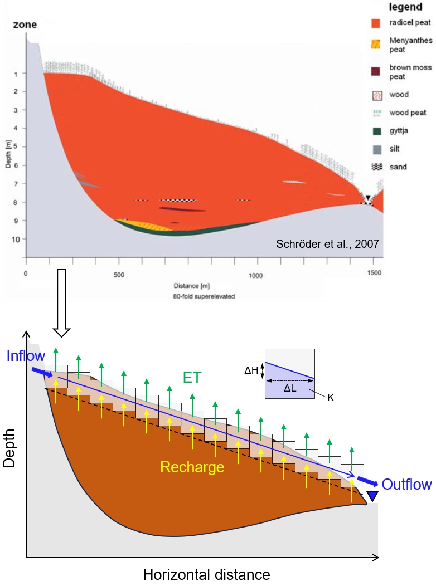

The example code for running the model to simulate spatial isotopic varations of peatland surface water in a 1-D transect, developed by Xia et al. and presented in a manuscsript submitted to Mires and Peat (submission date: Jan 26, 2024). The simulation output is same as the control run shown in Figure 6. 
 
A cartoon showing the scope of the 1-D model: 

   

 
The model simulation tuned to match with HN2208 data, by changing T/ET to 82% and multiplying ET/S by 5: 

   

